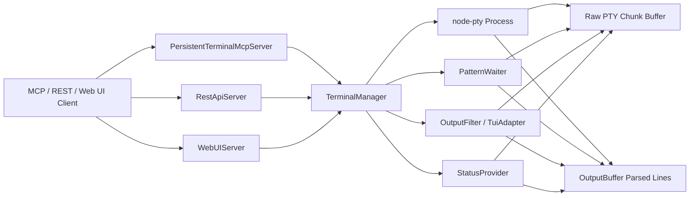
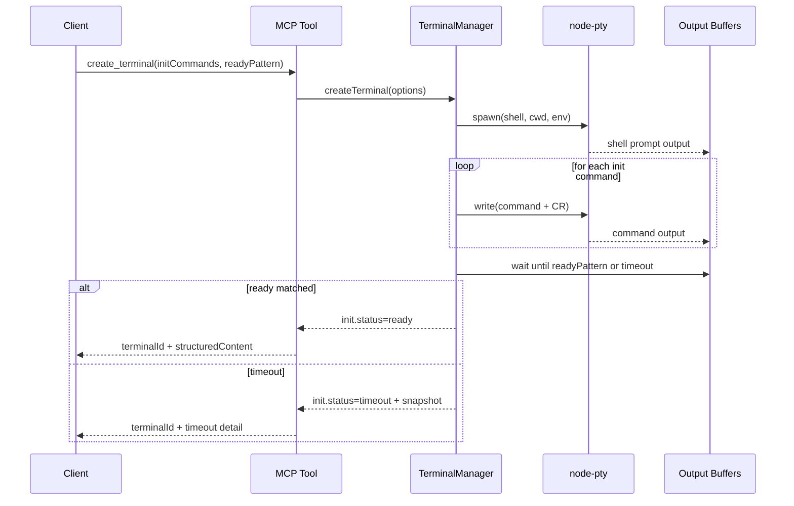
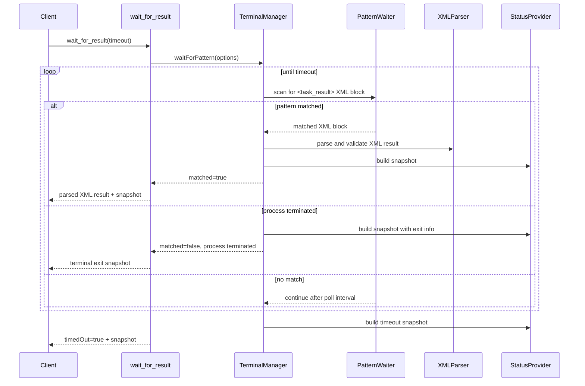
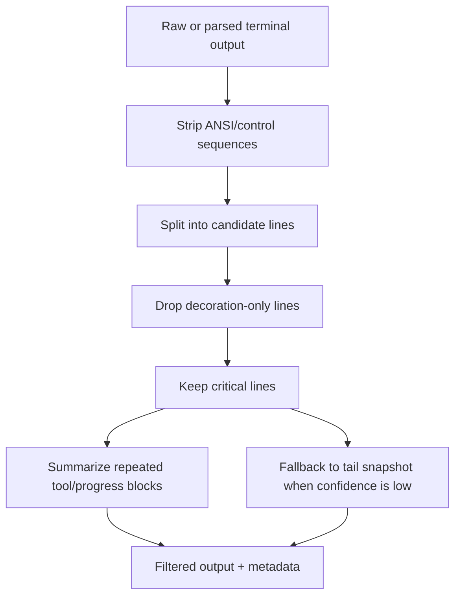
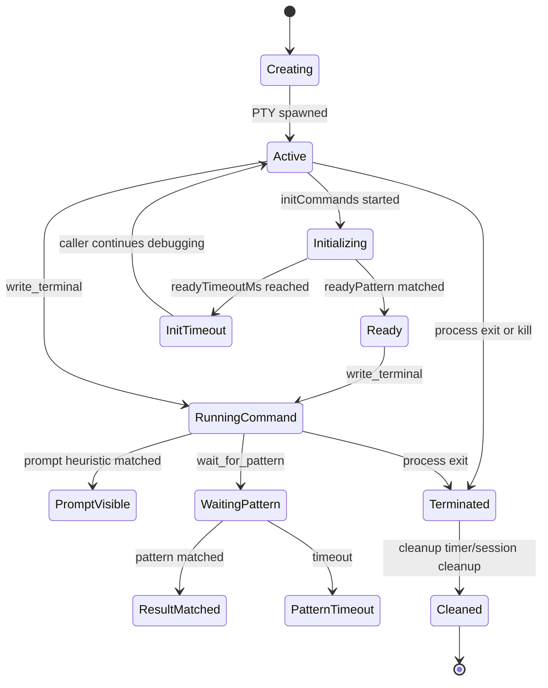

# persistent-terminal MCP Improvement System Design

Document ID: PT-ITER1-DESIGN-001
Date: 2026-06-06
Status: Updated after stakeholder answers

## Planning TODO

- [x] Read original requirement feedback.
- [x] Inspect `src/mcp-server.ts`, `src/terminal-manager.ts`, `src/types.ts`, REST API, Web UI, and tests.
- [x] Define module boundaries.
- [x] Define proposed tool/API contracts.
- [x] Model key workflows with Mermaid.
- [x] Identify infeasible designs and reject them.
- [x] Link this document from `doc/README-Index.md`.

## Design Principles

- Core behavior belongs in `TerminalManager`; MCP, REST API, and Web UI are all required iteration-1 surfaces.
- Existing tools remain backward compatible.
- Pattern waiting is generic; Claude/Codex transcript parsing is an optional adapter.
- Exact semantic state requires a cooperative status source. PTY text heuristics are always best-effort.
- New APIs must return bounded snapshots on timeout and failure.
- No sensitive command/env contents should be written to tracked files.
- Structured child-agent result reporting uses XML `<task_result>` blocks.

## Proposed Architecture



## Module Responsibilities

| Module | Responsibility | Planned Changes |
| --- | --- | --- |
| `src/types.ts` | Shared contracts | Add create init options, wait pattern/result types, status source types, output filter mode types. |
| `src/terminal-manager.ts` | PTY lifecycle and core terminal operations | Add create-with-init orchestration, wait-for-pattern, status snapshot, optional status file read, exit code storage. |
| `src/output-buffer.ts` | Parsed output storage | Keep generic; expose enough data for filtering and pattern wait. |
| New `src/output-filter.ts` | Best-effort content filtering | TUI decoration filtering and critical line preservation. |
| New `src/status-provider.ts` | Structured status abstraction | Combine process state, command heuristics, and optional status file. |
| `src/mcp-server.ts` | MCP schemas and formatting | Add tools and structured responses; keep text response readable. |
| `src/rest-api.ts` | HTTP adapter | Add required parity endpoints for init, status, pattern wait, result wait, and filtered output. |
| `src/web-ui-server.ts` | Browser adapter | Display structured status, init result, pattern/result wait outcomes, and filtered output controls. |
| `tests` | Regression and acceptance | Add unit, integration, fixture, and real-driver tests. |

## API Contract Proposal

### Create Terminal Options

Extend `create_terminal`; keep `create_terminal_basic` simple unless client compatibility requires duplicate options.

```ts
interface TerminalCreateOptions {
  shell?: string;
  cwd?: string;
  env?: Record<string, string>;
  cols?: number;
  rows?: number;
  initCommands?: string[];
  readyPattern?: string;
  readyTimeoutMs?: number;
  initFailurePattern?: string;
  statusFile?: string;
}
```

Response structured content:

```ts
interface CreateTerminalStructuredContent {
  terminalId: string;
  pid: number;
  shell: string;
  cwd: string;
  status: "active" | "terminated";
  init?: {
    status: "not_requested" | "ready" | "timeout" | "failed";
    readyPattern?: string;
    matched?: boolean;
    timedOut?: boolean;
    elapsedMs: number;
    outputPreview: string;
  };
}
```

### New Tool: `get_terminal_status`

```jsonc
{
  "terminalId": "uuid",
  "includeOutputPreview": true,
  "statusFile": "optional explicit path"
}
```

### Status Source Strategy

`get_terminal_status` must combine multiple evidence sources and report confidence:

1. Deterministic process/session evidence: session exists, PTY active/terminated, last activity, pending command, exit code/signal.
2. Explicit result evidence: valid `<task_result>` XML block in output.
3. Cooperative status evidence: optional status file written by a wrapper or child-agent launcher.
4. Heuristic evidence: prompt detection, recent output, spinner-like lines, and TUI prompt patterns.

Only cooperative status and explicit result XML may produce high-confidence semantic status. Heuristics must be labeled `semanticStatusConfidence="heuristic"` and must not be treated as exact child-agent state.

Returns:

```jsonc
{
  "terminalId": "uuid",
  "processStatus": "active|terminated|missing",
  "semanticStatus": "unknown|running|waiting_input|completed|error",
  "semanticStatusConfidence": "none|heuristic|cooperative",
  "lastActivity": "ISO-8601",
  "pendingCommand": null,
  "lastCommand": null,
  "promptVisible": true,
  "exit": { "code": 1, "signal": null },
  "statusFile": { "available": true, "path": "...", "parsed": true },
  "cursors": { "parsed": 123, "raw": 456 }
}
```

### New Tool: `wait_for_pattern`

```jsonc
{
  "terminalId": "uuid",
  "pattern": "<task_result>[\\s\\S]*?</task_result>",
  "timeoutMs": 300000,
  "pollIntervalMs": 250,
  "source": "parsed|raw|cleanRaw",
  "since": 0,
  "snapshotLines": 80,
  "maxChars": 12000
}
```

Returns:

```jsonc
{
  "matched": true,
  "match": {
    "text": "<task_result>...</task_result>",
    "groups": [],
    "namedGroups": {}
  },
  "timedOut": false,
  "elapsedMs": 1234,
  "cursor": 789,
  "status": {},
  "snapshot": "bounded output"
}
```

### New Tool: `wait_for_result`

Convenience wrapper around `wait_for_pattern`.

Default locator pattern:

```text
<task_result>[\s\S]*?</task_result>
```

XML contract:

```xml
<task_result>
  <status>PASS</status>
  <summary>Short human-readable result summary.</summary>
  <files>
    <file>relative/or/absolute/path.ext</file>
  </files>
  <tests>2 passed, 0 failed</tests>
  <duration_ms>1234</duration_ms>
  <errors>
    <error>Optional error detail.</error>
  </errors>
  <warnings>
    <warning>Optional warning detail.</warning>
  </warnings>
  <notes>Optional follow-up notes.</notes>
</task_result>
```

Parsing rules:

- Locate a bounded XML block in terminal output.
- Parse with an XML parser instead of ad hoc field splitting.
- Validate `status` as `PASS`, `FAIL`, or `ERROR`.
- Allow multiple `<file>`, `<error>`, and `<warning>` elements.
- Treat `duration_ms` as optional non-negative integer when present.
- Disable XML external entity expansion and network/entity resolution if supported by the parser.
- Return parsed XML fields, raw matched block, terminal status, and bounded snapshot.

### REST API Contract Additions

REST API parity is required in this iteration.

| Endpoint | Purpose |
| --- | --- |
| `POST /terminals` | Accept init options and ready pattern in request body. |
| `GET /terminals/:terminalId/status` | Return structured terminal status. |
| `POST /terminals/:terminalId/wait-pattern` | Wait for a caller-provided pattern. |
| `POST /terminals/:terminalId/wait-result` | Wait for and parse XML `<task_result>`. |
| `GET /terminals/:terminalId/output?mode=content_only` | Return filtered output and filter metadata. |

### Web UI Contract Additions

Web UI parity is required in this iteration.

- Terminal list displays structured status and last activity.
- Terminal detail page exposes status refresh.
- Terminal detail page supports filtered output view.
- Terminal detail page can run wait-for-pattern and wait-for-result operations with visible timeout/result state.
- Initialization result and timeout snapshot are visible after terminal creation.

### Extended `read_terminal`

Keep existing enum values and add:

- `content_only`: best-effort filtered output.
- `last_response`: adapter-specific response extraction.

The response must include filter metadata:

```jsonc
{
  "filter": {
    "mode": "content_only",
    "adapter": "generic|claude|codex",
    "confidence": "low|medium|high",
    "removedLines": 120,
    "criticalLineCount": 6
  }
}
```

Filtering correctness rule:

- `content_only` must preserve every line or block required for the primary agent to judge success, failure, pending approval, crash, or ambiguity.
- Character reduction is useful but not a release gate by itself.
- When the filter is unsure, it must retain more content and lower confidence rather than aggressively remove output.

### Resume Contract

Resume is a new-terminal wrapper, not PTY resurrection.

Default Claude Code CLI convention:

```text
claude --resume <session-id>
```

Inputs should allow explicit override, but the built-in Claude Code path must support:

- `sessionId`
- `initCommands`
- `readyPattern`
- `readyTimeoutMs`
- bounded resume output snapshot

## EventStorming Big Picture

```mermaid
flowchart LR
  A["Actor: Primary Agent"]:::actor
  C1["Command: Create terminal with init"]:::command
  E1["Event: PTY session created"]:::event
  C2["Command: Run init commands"]:::command
  E2["Event: Init output captured"]:::event
  C3["Command: Wait for ready pattern"]:::command
  E3["Event: Terminal ready or timeout"]:::event
  C4["Command: Send child-agent task"]:::command
  E4["Event: TUI output streamed"]:::event
  C5["Command: Wait for result pattern"]:::command
  E5["Event: Result matched, timeout, or process exited"]:::event
  C6["Command: Query structured status"]:::command
  E6["Event: Status snapshot returned"]:::event
  H1["Hotspot: Exact semantic status requires cooperative source"]:::hotspot

  A --> C1 --> E1 --> C2 --> E2 --> C3 --> E3 --> C4 --> E4 --> C5 --> E5
  A --> C6 --> E6
  E4 --> H1

  classDef actor fill:#d8ecff,stroke:#1b6ca8,color:#000;
  classDef command fill:#e9ddff,stroke:#6c4bb8,color:#000;
  classDef event fill:#ffe2bf,stroke:#b86b00,color:#000;
  classDef hotspot fill:#ffd6d6,stroke:#c0392b,color:#000;
```



## Key Flow: Create With Init



## Key Flow: Wait For Result



## Key Flow: Content Filtering



## Terminal State Model



## Error Handling Matrix

| Code | Condition | Response |
| --- | --- | --- |
| `TERMINAL_NOT_FOUND` | Unknown terminal id | Existing behavior; return tool error. |
| `TERMINAL_INACTIVE` | Write or wait on inactive terminal | Return status snapshot if possible. |
| `INIT_TIMEOUT` | Ready pattern not matched | Return terminal id, timeout, bounded output snapshot. |
| `PATTERN_TIMEOUT` | Wait pattern not matched | Return `timedOut=true`, cursor, status, snapshot. |
| `INVALID_PATTERN` | Bad regex | Return validation error before polling. |
| `STATUS_FILE_UNAVAILABLE` | Missing/unreadable status file | Return status with `available=false`; not fatal. |
| `STATUS_FILE_INVALID` | Invalid JSON/schema | Return status with parse error; not fatal. |
| `RESULT_XML_NOT_FOUND` | XML result block not found before timeout | Return timeout and bounded snapshot. |
| `RESULT_XML_INVALID` | XML block is malformed or violates schema | Return parse error, matched block preview, and status snapshot. |

## Security Notes

- Do not print full environment maps in status or init results.
- Do not write status snapshots to tracked files by default.
- If initialization commands contain secrets, the caller is responsible for avoiding git-tracked logs; server responses should be bounded and redaction-capable.
- XML parsing must disable unsafe external entity behavior where the chosen parser supports it.

## Backward Compatibility

- Existing tool names remain.
- Existing `read_terminal` modes remain.
- `structuredContent` can be added without removing text output.
- New options are optional.
- Tests must verify old clients can still call `create_terminal_basic` with only `shell` and `cwd`.
